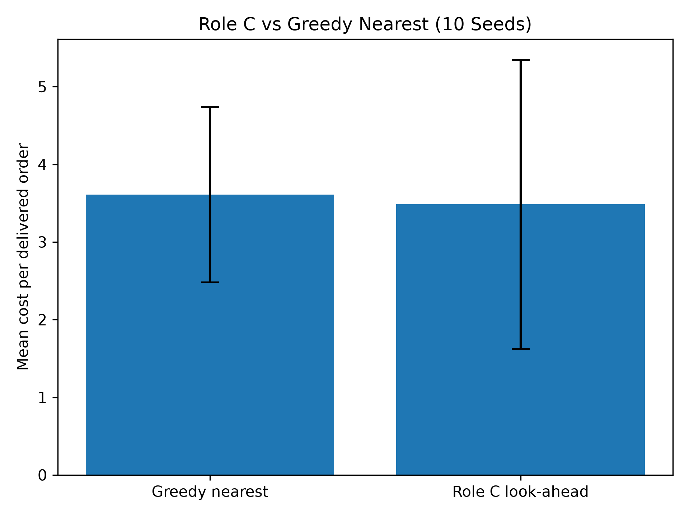
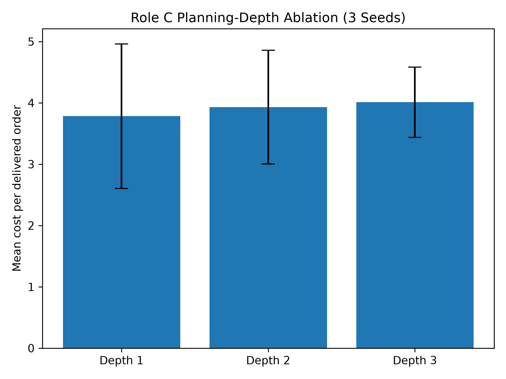

# Role C — Short-Horizon Look-Ahead Planning

## 1. Method

Role C implements a short-horizon look-ahead dispatch policy for the centralized drone-delivery environment.

The policy evaluates feasible drone-to-order assignments using three signals:

1. **Pickup distance:** assignments with shorter travel distance to the pickup point are preferred.
2. **Order urgency:** orders that are closer to the SLA limit receive higher priority.
3. **Battery risk:** assignments that are likely to leave a drone with critically low state of charge are penalized.

In addition to the immediate assignment score, the planner estimates the effect of assigning a drone on future fleet capacity. This estimate considers the expected incoming demand, the number of remaining idle drones, and the battery levels of the available fleet.

The final selected method is an approximate short-horizon look-ahead planner. It is not presented as full MCTS or an exact simulator rollout. Instead, it uses a lightweight future-capacity estimate to make dispatch decisions while remaining computationally efficient.

## 2. Experimental Setup

The final Role C policy was evaluated using the standard evaluation configuration and ten random seeds:

```text
0, 1, 2, 3, 4, 5, 6, 7, 8, 9
```

The baseline policy was `greedy_nearest`.

The final Role C configuration was:

```yaml
planning_depth: 1
forecast_weight: 1.0
```

The primary evaluation metric was mean cost per delivered order. Additional metrics included the number of delivered and dropped orders and the on-time delivery rate.

## 3. Main Results

| Method            | Cost per Order | Delivered Orders | Dropped Orders |  On-Time Rate |
| ----------------- | -------------: | ---------------: | -------------: | ------------: |
| Greedy nearest    |  3.611 ± 1.129 |   121.80 ± 10.60 |   16.30 ± 5.95 | 0.924 ± 0.028 |
| Role C look-ahead |  3.484 ± 1.860 |   123.00 ± 13.99 |   16.00 ± 7.86 | 0.929 ± 0.019 |

The proposed Role C planner reduced the mean cost per delivered order from 3.611 to 3.484 compared with `greedy_nearest`. This corresponds to an approximate 3.5% mean improvement.

The policy also increased the average number of delivered orders from 121.80 to 123.00, reduced average dropped orders from 16.30 to 16.00, and improved the average on-time delivery rate from 0.924 to 0.929.

The standard deviations indicate substantial variation across seeds. Therefore, the result is reported as an improvement in mean performance rather than a claim of statistically confirmed dominance.



*Figure 1. Mean cost per delivered order over ten evaluation seeds. Error bars show one standard deviation.*

## 4. Planning-Depth Ablation

To study the planning horizon, the planner was evaluated with depths of 1, 2, and 3 over seeds 0, 1, and 2.

| Planning Depth | Cost per Order |
| -------------- | -------------: |
| 1              |  3.782 ± 1.179 |
| 2              |  3.931 ± 0.926 |
| 3              |  4.010 ± 0.572 |

A planning depth of 1 produced the lowest mean cost. Increasing the depth worsened performance in this implementation because the future fleet-capacity term is an approximation. Longer horizons increased accumulated estimation error and made decisions more conservative.



*Figure 2. Planning-depth ablation over three evaluation seeds. Error bars show one standard deviation.*

## 5. Reproducibility

The final Role C policy can be reproduced with:

```powershell
python run_rollout.py --planner-config configs/rollout_role_c.yaml
```

The evaluation summary can be reproduced with:

```powershell
python -m code.summarize_role_c
```

The figures can be regenerated with:

```powershell
python -m code.plot_role_c_results
```
# B Role — Policy-Based Reinforcement Learning

## Final Dispatcher Policy

The final dispatcher is a pairwise policy trained from demonstrations generated by the MILP rolling-horizon baseline.

Instead of scoring all 169 dispatcher actions independently, the policy scores each drone-order pair using shared features. This improves generalization because the same scoring function is applied to all candidate drone-order assignments.

## Training Setup

- Training method: supervised imitation learning from MILP rolling-horizon decisions
- Architecture: pairwise drone-order scoring network
- Training runs: 3 independent runs
- Training seed groups:
  - Run 0: seeds 0–74
  - Run 1: seeds 75–149
  - Run 2: seeds 150–224
- Held-out evaluation seeds: 300–319

## Held-Out Results

| Metric | MILP-Guided Pairwise Policy |
|---|---:|
| Cost per order | 2.9684 ± 0.5976 |
| Success rate | 0.9052 ± 0.0171 |
| On-time rate | 0.9409 ± 0.0020 |
| Energy per order | 0.2210 ± 0.0009 |
| Depletion events | 1.9833 ± 0.3472 |
| Delivered orders | 123.5500 ± 2.6574 |
| Dropped orders | 13.5000 ± 2.3836 |
| Episode return | 1482.6644 ± 89.5978 |

## Baseline Comparison

| Method | Cost per delivered order |
|---|---:|
| Greedy nearest | 3.9810 |
| MILP-guided pairwise policy | 2.9684 ± 0.5976 |

The final policy reduced cost per delivered order by approximately 25% relative to greedy nearest on held-out seeds.

## Development Path

1. REINFORCE baseline
2. GAE-based actor-critic experiments
3. Route-aware state representation
4. Behavior cloning from greedy-nearest decisions
5. Pairwise drone-order scoring architecture
6. Battery-aware feature ablation
7. MILP-guided imitation learning
8. Three-seed held-out evaluation

The battery-aware feature ablation did not improve held-out performance, so the simpler eight-feature pairwise representation was retained.

## DDPG Continuous-Control Experiment

A DDPG implementation was created for `DroneControl-v0`.

Implemented components:

- Actor network
- Critic network
- Replay buffer
- Target actor and critic networks
- Gaussian exploration noise
- Soft target updates

The initial DDPG policy did not generalize reliably.

| Metric | Result |
|---|---:|
| Mean reward on seeds 100–104 | -1005.50 |
| Reward standard deviation | 933.14 |
| Success rate | 0.00 |

Diagnostic rollouts showed unstable heading correction and frequent battery depletion before reaching the target. This is documented as a failure-analysis result.
